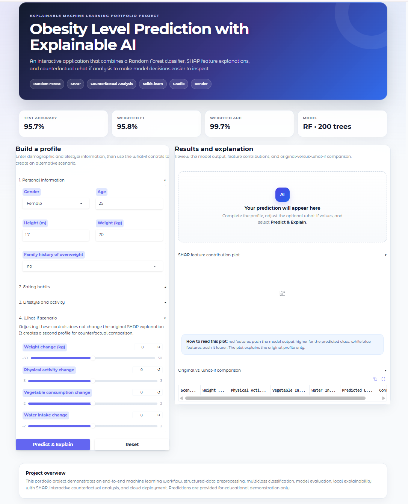
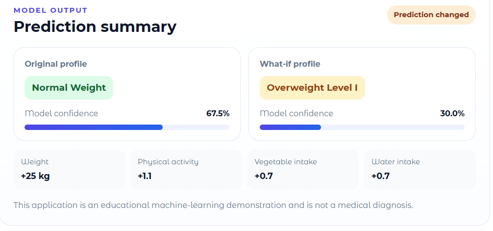
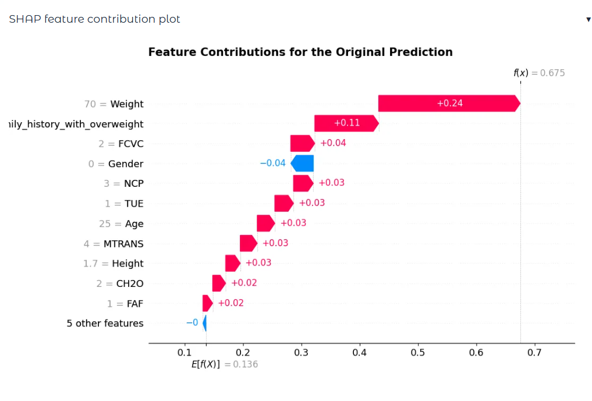
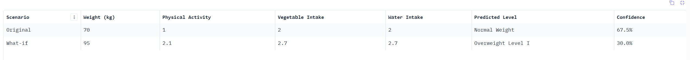

# Obesity Level Prediction with Explainable AI

An interactive explainable machine learning application for multiclass obesity-level prediction using Random Forest, SHAP, and what-if counterfactual analysis.

The system predicts obesity levels from demographic, dietary, physical, and lifestyle-related features. It also explains individual predictions through SHAP waterfall plots and allows users to explore how changes in weight, physical activity, vegetable consumption, and water intake may affect the model output.

> This project is an educational machine learning demonstration and does not constitute medical diagnosis or health advice.

---

## Live Demo

Try the deployed application:

**[Open the Obesity XAI Web Application](https://obesity-xai-prediction.onrender.com)**

The application is hosted on Render. The free instance may require a short startup time after a period of inactivity.

---

## Project Preview

### Interactive Web Interface



### Prediction Summary



### SHAP Local Explanation



### What-if Counterfactual Comparison



---

## Key Features

- Multiclass obesity-level prediction
- Random Forest classifier with 200 decision trees
- SHAP waterfall plot for local prediction explanation
- What-if counterfactual analysis
- Original and modified profile comparison
- Prediction confidence visualization
- Responsive Gradio web interface
- Cloud deployment through GitHub and Render

---

## Model Performance

The Random Forest model was evaluated on a stratified test set.

| Metric | Score |
|---|---:|
| Test Accuracy | 95.7% |
| Weighted F1-score | 95.8% |
| Weighted AUC | 99.7% |

The model performs multiclass classification across seven obesity-level categories.

---

## Explainable AI Methods

### SHAP Explanation

SHAP is used to explain individual Random Forest predictions.

The waterfall plot shows how each feature contributes positively or negatively to the predicted obesity class.

Examples of interpreted features include:

- Weight
- Family history of overweight
- Physical activity
- Vegetable consumption
- Water intake
- Age
- Height
- Transportation mode

### What-if Counterfactual Analysis

The what-if module allows users to modify selected actionable features while keeping the remaining profile unchanged.

The current application supports changes to:

- Weight
- Physical activity frequency
- Vegetable consumption
- Water intake

The original and modified profiles are then compared using their predicted classes and confidence scores.

---

## Dataset

This project uses the **Obesity Levels Based on Eating Habits and Physical Condition** dataset.

The dataset contains 16 input features covering:

- Demographic information
- Body measurements
- Eating habits
- Physical activity
- Water consumption
- Technology usage
- Transportation mode
- Family history and lifestyle factors

The target variable is:

```text
NObeyesdad
```

It represents seven obesity-level categories.

More information is available in:

**[Dataset Documentation](data/README.md)**

---

## Technology Stack

| Category | Technologies |
|---|---|
| Programming | Python |
| Data Processing | Pandas, NumPy |
| Machine Learning | Scikit-learn, Random Forest |
| Explainable AI | SHAP |
| Visualization | Matplotlib |
| Web Interface | Gradio |
| Version Control | GitHub |
| Deployment | Render |

---

## Project Structure

```text
obesity-xai-prediction/
│
├── app.py
├── requirements.txt
├── .python-version
├── .gitignore
├── README.md
├── LICENSE
├── ObesityDataSet_raw_and_data_sinthetic.csv
│
├── notebooks/
│   └── obesity_xai_analysis.ipynb
│
├── assets/
│   ├── web_interface.png
│   ├── prediction_summary.png
│   ├── shap_waterfall.png
│   └── counterfactual_comparison.png
│
├── docs/
│   └── Explainable Obesity Level Prediction System _ Portfolio.pdf
│
└── data/
    └── README.md
```

---

## Analysis Notebook

The complete model-development and explainability workflow is available in:

**[View the Analysis Notebook](notebooks/obesity_xai_analysis.ipynb)**

The notebook includes:

1. Dataset loading
2. Data preprocessing
3. Categorical feature encoding
4. Stratified train-test split
5. Random Forest training
6. Accuracy, F1-score, and AUC evaluation
7. Confusion matrix
8. ROC curve analysis
9. Precision-Recall curve analysis
10. SHAP local explanation
11. What-if counterfactual analysis

---

## Run the Application Locally

### 1. Clone the repository

```bash
git clone https://github.com/hee289427-wq/obesity-xai-prediction.git
cd obesity-xai-prediction
```

### 2. Create a virtual environment

Windows:

```bash
python -m venv venv
venv\Scripts\activate
```

macOS or Linux:

```bash
python -m venv venv
source venv/bin/activate
```

### 3. Install the dependencies

```bash
pip install -r requirements.txt
```

### 4. Check the dataset

Make sure the following file is located in the project root directory:

```text
ObesityDataSet_raw_and_data_sinthetic.csv
```

### 5. Start the Gradio application

```bash
python app.py
```

Open the local address shown in the terminal.

It will usually be similar to:

```text
http://127.0.0.1:10000
```

---

## Portfolio

A project portfolio presenting the system design, model performance, explainability methods, web interface, deployment, and personal contributions is available here:

**[View the Project Portfolio](<docs/Explainable Obesity Level Prediction System _ Portfolio.pdf>)**

---

## Project Background and Personal Contribution

The initial academic study was completed as a collaborative coursework project.

This repository presents my individually developed portfolio implementation, including:

- Data preprocessing and model experimentation
- Random Forest configuration and evaluation
- SHAP local explanation integration
- What-if counterfactual analysis
- Gradio web application development
- User-interface redesign
- GitHub project organization
- Render cloud deployment
- Portfolio documentation

---

## Limitations

- The model is trained on a specific structured dataset and may not generalize to all populations.
- Label encoding is used for categorical variables.
- Counterfactual analysis modifies selected features independently and does not guarantee medically realistic outcomes.
- Model predictions should not be used as clinical conclusions.

---

## Author

**何宸臻（Eric He）**

Master of Artificial Intelligence  
Universiti Malaya

GitHub Repository:

https://github.com/hee289427-wq/obesity-xai-prediction

---

## License

This project is licensed under the MIT License.
